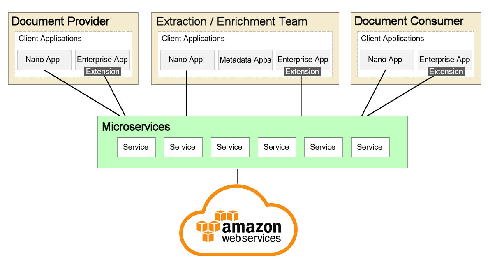

# Software Architecture Document 
## 1.	Introduction
This document provides a comprehensive architectural overview of the Scalable Document Storage (SDS) system which provides a scalable solution for document submission, persistence, metadata extraction, categorization, and search capability. 

## 2.	Architectural Goals and Constraints
Key requirements and system constraints that have a significant bearing on the architecture.  

1.	Users will interact using new “nano-apps” or the existing enterprise application with extensions for accessing microservices.

2.	The system must provide the ability to submit up to 1000 documents per hour, averaging 50 Gigabytes each.

3.	The system must provide the ability to upgrade extraction / enrichment methods on a weekly basis.

4.	The system must provide the ability to search for provided documents using extracted / enriched metadata. Search feature must support up to 5,000 concurrent searches.

5.	The system must provide the ability to deliver documents at the rate of 20,000 documents per day.

6.	Security concerns are not within the scope of this solution.

## 3.	Use-Case View
### Actors
* ### Document Providers
      Provide documents to the system.
      
* ### Extraction / Enrichment Team
      Team focused on metadata extraction and enrichment for each provided document.

* ### Document Consumers
      Search for and request delivery of provided documents using extracted / enriched metadata. 
	
### Use Cases
1.	Submit and persist documents.
2.	Upgrade extraction / enrichment methods.
3.	Search for documents.
4.	Request delivery of documents.

## 4.	Logical View
A description of the logical view of the architecture describing the most important classes, their organization in service packages and subsystems, and the organization of these subsystems into layers. 

## 5.	Process View
A description of the architecture describing the tasks (processes and threads) involved in the system's execution, their interactions and configurations.

## 6.	Deployment View
 

*	Document providers and consumers submit, search, and retrieve provided documents using new nano-app or via an extension to the existing enterprise application.
*	Extraction / Enrichment Team enhances and improves document metadata and pushes new releases into production.
*	Microservices allow each service to be independently scaled to meet demand for the client applications.
*	The data management solution is hosted in Amazon Web Services.

## 7.	Data View
A description of the AWS data management solution as well as backup and restoration strategies.

